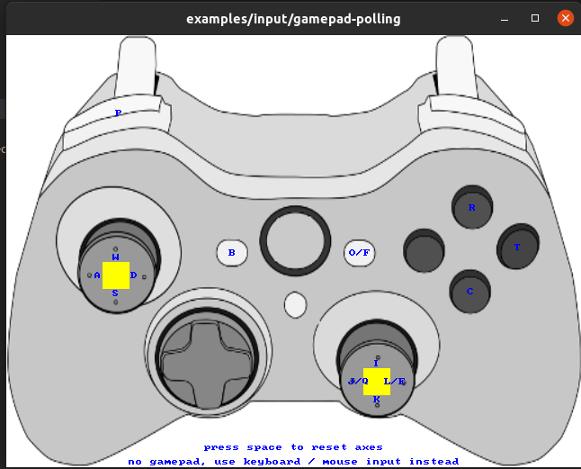

# LejuLab

[](https://opensource.org/licenses/MIT) [](http://wiki.ros.org/noetic) [](https://ubuntu.com/) [](https://isocpp.org/) []() []() []()

乐聚人形机器人强化学习部署开发平台，提供 Roban 和 Kuavo 系列机器人的仿真与实物控制支持。

## 功能特性

- **多机器人支持**：支持 Roban 2 代、Kuavo 4 代、Kuavo 5 代等多款人形机器人
- **Mujoco 仿真**：基于 Mujoco 物理引擎的高精度仿真环境
- **实物控制**：提供底层电机控制、IMU 传感器读取等硬件接口
- **强化学习控制器**：内置 AMP 行走、Mimic 舞蹈等控制算法
- **手柄遥控**：支持游戏手柄进行机器人遥控操作
- **高性能通信**：基于 CycloneDDS + iceoryx 共享内存的低延迟进程间通信

## 系统架构

```
+-----------------------------------------------------------------------------------+
|                              Control Layer                                        |
+-----------------------------------------------------------------------------------+
|                                                                                   |
|                        +-----------------------------+                            |
|                        |     ControllerManager       |                            |
|                        |                             |                            |
|                        |  ControllerBase (Plugin)    |                            |
|                        |   +---------------------+   |                            |
|                        |   | GenericRLController |   |                            |
|                        |   | - ONNX/OpenVINO     |   |                            |
|                        |   | - Observation Terms |   |                            |
|                        |   | - Action Scaling    |   |                            |
|                        |   +---------------------+   |                            |
|                        |   + ArmController           |                            |
|                        |   + WaistController         |                            |
|                        +-----------------------------+                            |
|                                                                                   |
+-----------------------------------------------------------------------------------+
                                       |
                        +--------------+--------------+
                        |                             |
                        v                             |
             publishRobotCmd(cmd)          subscribeXxx(callback)
                  [Send Cmd]                   [Recv Data]
                        |                             |
                        v                             |
+-----------------------------------------------------------------------------------+
|                                  lejusdk                                          |
+-----------------------------------------------------------------------------------+
|                                                                                   |
|    +-----------------------------------------------------------------------+      |
|    |                      liblejusdk-lowlevel.so                           |      |
|    |                                                                       |      |
|    |    +-----------------+       +----------------------------------+     |      |
|    |    |  GlobalRobot    |       |          RobotBaseAPI            |     |      |
|    |    |  (Singleton)    |------>|                                  |     |      |
|    |    +-----------------+       |  subscribeImuData(callback)      |     |      |
|    |                              |  subscribeRobotState(callback)   |     |      |
|    |                              |  subscribeJoyData(callback)      |     |      |
|    |                              |  subscribeHardwareState(callback)|     |      |
|    |                              |  publishRobotCmd(cmd)            |     |      |
|    |                              |                                  |     |      |
|    |                              |       +--------------+           |     |      |
|    |                              |       |KuavoHumanoid |           |     |      |
|    |                              |       +--------------+           |     |      |
|    |                              +----------------------------------+     |      |
|    +-----------------------------------------------------------------------+      |
|                                                                                   |
|    +-----------------------------------------------------------------------+      |
|    |                      liblejusdk-vr.so                                |      |
|    |                                                                       |      |
|    |    VR Head/Arm/Waist control API, used by leju-ik                |      |
|    +-----------------------------------------------------------------------+      |
|                                                                                   |
+-----------------------------------------------------------------------------------+
                        |                             ^
                        |                             |
                        v                             |
              +-----------------+           +-----------------+
              |    RobotCmd     |           |    ImuData      |
              |  - q[]  (pos)   |           |    RobotState   |
              |  - v[]  (vel)   |           |    JoyData      |
              |  - tau[] (torq) |           |    HardwareState|
              |  - kp[] (stiff) |           +-----------------+
              |  - kd[] (damp)  |                   ^
              |  - modes[]      |                   |
              +-----------------+                   |
                        |                           |
                        v                           |
+-----------------------------------------------------------------------------------+
|                              Hardware / Sim                                       |
+-----------------------------------------------------------------------------------+
|                                                                                   |
|    +---------------------------+       +---------------------------+              |
|    |     leju-mujoco-sim       |       |      leju-hardware        |              |
|    |                           |       |                           |              |
|    |   +-------------------+   |       |   +-------------------+   |              |
|    |   | MuJoCo Physics    |   |       |   | EtherCAT Driver   |   |              |
|    |   | Sensor Simulation |   |       |   | IMU Data Collect  |   |              |
|    |   | Motor Execution   |   |       |   | Joint Feedback    |   |              |
|    |   +-------------------+   |       |   +-------------------+   |              |
|    |                           |       |                           |              |
|    |       [Simulation]        |       |      [Real Robot]         |              |
|    +---------------------------+       +---------------------------+              |
|                                                                                   |
+-----------------------------------------------------------------------------------+
```

## 目录结构

```bash
tree src -d -L 2
src
├── leju_assets       # 资源模块，自动同步，不要编辑
│   ├── include
│   ├── models
│   └── src
├── leju-controllers  # 控制器
│   ├── leju-dummy-controller
│   └── leju-rl-controller
├── leju-ik           # Quest3 IK 解算模块
│   ├── config
│   ├── include
│   ├── src
│   └── test
├── leju_launch       # 提供一键启动所有必要的功能模块
│   ├── config
│   ├── launch
│   └── scripts
├── leju-remote       # Quest3 数据接入与 UDP 转发工具
│   ├── protos
│   ├── protos_c
│   └── src
├── leju-vr-control   # Quest3 VR 控制节点（手臂、头部、速度、腰部控制）
│   ├── config
│   ├── include
│   └── src
└── lejusdk           # Leju SDK，自动同步，不要编辑
    ├── examples
    ├── lejusdk-lowlevel   # 底层控制 SDK，提供电机控制与状态读取、IMU 传感器状态读取接口等
    ├── lejusdk-utils      # SDK 工具类, 提供辅助函数
    └── lejusdk-vr         # 外部控制 SDK，提供头部、手臂和腰部控制以及控制器相关接口
```

## LejuSDK 文档

LejuSDK 是 Leju 机器人软件开发工具包，提供多层次的机器人控制接口。详细文档请参考 [LejuSDK 文档](./docs/leju-sdk/index.html)。

您可以clone本仓库在网站打开LejuSDK文档进行浏览

## 依赖安装

```bash
sudo apt-get update && sudo apt-get install -y \
    build-essential cmake \
    libacl1-dev libncurses5-dev
```

## 编译

```bash
source installed/setup.bash  # !!! IMPORTANT !!! 非常重要,不可省略
# source installed/setup.zsh  # !!! IMPORTANT !!! 非常重要,不可省略 如果是zsh
catkin build
```

## 部署 iceoryx 共享内存（首次使用需执行）

项目支持通过 iceoryx 共享内存加速进程间通信，建议部署以获得更优的实时性能：

```bash
./src/leju_launch/scripts/setup_cyclonedds_config.sh
```

部署脚本会完成以下操作：
- 安装 RouDi 守护进程为系统服务（开机自启）
- 部署 CycloneDDS 配置文件到 `/etc/cyclonedds/`
- 设置 `CYCLONEDDS_URI` 环境变量默认为 `cyclonedds_shm.xml`

> **注意：** 部署完成后需要**注销当前用户重新登录**或**重启系统**才能生效。

卸载：

```bash
./src/leju_launch/scripts/setup_cyclonedds_config.sh --remove
```

## 运行

### 通用说明

- **选择机器人版本（数值定义参考 `lejusdk-utils/robot_version.hpp` 中 `RobotVersions` 常量）**
  - `export ROBOT_VERSION=14`  ：Roban 2 代基础版（`RobotVersions::ROBAN2_BASE`）
  - `export ROBOT_VERSION=46`  ：Kuavo 4 代 UAE 版本（`RobotVersions::KUAVO4_UAE`）
  - `export ROBOT_VERSION=52`  ：Kuavo 5 代基础版（`RobotVersions::KUAVO5_BASE`）
- **手柄控制（通用）**
  - `start`：从待机/准备状态切换到运行/站立状态
  - `back`：进入安全停机/关节松弛状态
  - 其他按键和摇杆：根据不同控制器（如 RL demo / mimic）实现行走、转向、舞蹈等功能，详见对应控制器文档

### Mujoco 仿真

```bash
source devel/setup.bash

# Roban2
export ROBOT_VERSION=14
roslaunch leju_launch load_mujoco_sim.launch

# Kuavo4pro
export ROBOT_VERSION=46
roslaunch leju_launch load_mujoco_sim.launch

# Kuavo5
export ROBOT_VERSION=52
roslaunch leju_launch load_mujoco_sim.launch
```

- 通过如上命令启动控制器、Mujoco 仿真器和手柄控制等功能包
- 根据终端提示，按下`start`按键
- 点击 Mujoco 仿真中的 `Run` 运行按钮
- tips: 如果开始时机器人倒地，可以先`Pause`和`Reset`仿真，然后再`Run`

### 实物机器人

```bash
sudo su # 实物需要在root用户下运行
source devel/setup.bash

# Roban2
export ROBOT_VERSION=14
roslaunch leju_launch load_real.launch

# Kuavo4pro
export ROBOT_VERSION=46
roslaunch leju_launch load_real.launch

# Kuavo5
export ROBOT_VERSION=52
roslaunch leju_launch load_real.launch
```

- 对于实物机器人，也许您首先需要对电机进行零点标定，但这并不是必须的，因为机器人在出厂时已经标定完毕，如果存在如下情况您可手动执行标定工具重新进行标定:
  - **准备站立时，发现关节角度与零点位置位置存在偏差**
  - 硬件维修更换电机
- 电机零点标定工具参考文档: [电机零点标定工具](./docs/howto-use-motor-cali-tool.md)
- 拉起机器人背后的急停按钮，执行上述命令
- 将移位架升起，等待机器人进入膝盖微曲状态
- 降低移位架，让机器人脚掌刚刚好接触地面
- 使用手柄 `start` 按键使机器人站立
- **结束使用机器人请按手柄 `back` 按键**

### 控制器配置

控制器配置文件位于 `src/leju-controllers/leju-rl-controller/config/<ROBOT_VERSION>/controller_manager.yaml`，通过修改 `default_controller` 字段切换控制模式：

#### Mimic 舞蹈（仅 Roban2）

```yaml
default_controller: "mimic"
```

待机器人站立之后，按下西瓜键即可播放舞蹈，播放结束后再次按西瓜键可重复播放。

#### AMP 行走

```yaml
default_controller: "amp"
```

待机器人站立之后，左摇杆控制前后左右，右摇杆控制左右转向。


## 输入控制设备

### 手柄



### Quest3 VR 控制

#### 启动方式

```bash
sudo su  # 需要 root 权限
source devel/setup.bash

# kuavo5
export ROBOT_VERSION=52
roslaunch leju_launch vr_teleop.launch

# kuavo4pro
export ROBOT_VERSION=46
roslaunch leju_launch vr_teleop.launch
```

如果需要手动指定 Quest3 的 IP，可以追加参数：

```bash
roslaunch leju_launch vr_teleop.launch quest_ip:=192.168.1.100
```

#### 适用机型与限制

| 机型              | 手臂控制 | 头部控制 | 速度控制 | 腰部控制 | 备注                    |
| ----------------- | -------- | -------- | -------- | -------- | ----------------------- |
| `Kuavo4Pro(46)` | 支持     | 支持     | 支持     | 不支持   | 无腰部自由度            |
| `Kuavo5(52)`    | 支持     | 支持     | 支持     | 支持     | 左手 `Y` 触摸时可控腰 |
| `Roban(14)`     | 不开放   | 不开放   | 不开放   | 不开放   | 当前节点启动即退出      |

#### 操作方式

- `X+A`
  - 在 `Auto(1)` 和 `External(2)` 之间切换
- `X+B`
  - 在 `KeepPose(0)` 和 `External(2)` 之间切换
- `X+Y`
  - 进入安全停机/关节松弛状态
- 左/右 `grip`
  - 对应手臂进入增量控制
- 头部
  - 由头显姿态驱动
- 左摇杆
  - 发布原始范围 `[-1, 1]` 的平移速度指令
  - 上推前进、下拉后退、左推左移、右推右移
- 右摇杆
  - 发布原始范围 `[-1, 1]` 的旋转速度指令
  - 左推左转、右推右转

三个手臂模式的效果如下：

| 模式         | 值    | 效果                                                           |
| ------------ | ----- | -------------------------------------------------------------- |
| `KeepPose` | `0` | 保持当前手臂姿态，适合临时停在当前位置                         |
| `Auto`     | `1` | 交还给默认自动行为（行走时摆臂），手臂不再接受当前 VR 增量控制 |
| `External` | `2` | 进入 VR 外部控制模式，按住对应 `grip` 后可进行增量控制       |

`Kuavo5(52)` 额外支持腰部控制：

- 左手只触摸 `Y`
- 右摇杆左右绝对控制腰部 yaw
- 触摸 `Y` 时 walking 被禁用
- 松开 `Y` 后腰部回零

#### 使用示例

1. 启动 `vr_teleop.launch`
2. 大臂垂直于地面，小臂水平于地面，长按 meta 键标定骨骼点
3. 按 `X+A` 切到 `External(2)`
4. 按住单侧或双侧 `grip`，移动 Quest3 手柄开始控制手臂
5. 若机器人为 `Kuavo5(52)`，可在需要时左手触摸 `Y`，再用右摇杆 x 轴调节腰部

## 数据可视化

### Foxglove Studio

[Foxglove Studio](https://foxglove.dev/) 是支持 MCAP 格式的可视化工具，可用于查看录制的机器人数据（关节状态、IMU 数据等）。

- 网页版：https://studio.foxglove.dev/
- 桌面版：https://foxglove.dev/download

### 使用布局文件

项目提供了预定义的布局文件，位于 `config/` 目录：

| 文件 | 适用机器人 |
|------|-----------|
| `foxglove-roban2-1-layout.json` | Roban 2.1 |
| `foxglove-kuavo4pro-layout.json` | Kuavo 4 Pro |
| `foxglove-kuavo5-layout.json` | Kuavo 5 |

**导入布局：**

1. 在 Foxglove Studio 中打开 `.mcap` 数据文件
2. 点击右上角 **Layout** 菜单
3. 选择 **Import layout**，导入对应机器人的布局文件

布局文件包含常用的面板配置（关节位置、速度、力矩、IMU 数据等），避免每次重复设置。


## 已知问题
- Roban 2 代基础版的扭矩常数不准确：导致 CST 模式下的 AMP 步态会出现剧烈振动，目前正在重新测试扭矩常数。
- CSP 不纯粹：用户层 CSP 下发的 joint_cmd 中 joint_q 是关节当前位置而非目标位置。

## 故障排除

### iceoryx 共享内存错误

如果运行时出现以下错误：

```
[leju-mujoco-sim] 错误: iceoryx 共享内存已启用但 RouDi 未运行!
[leju-mujoco-sim] 请先部署: ./src/leju_launch/scripts/setup_cyclonedds_config.sh
[leju-mujoco-sim] 或手动启动: ./src/leju_launch/scripts/start_roudi.sh
```

**解决方案：**

1. **首次使用**：执行 [部署 iceoryx 共享内存](#部署-iceoryx-共享内存首次使用需执行) 部分的部署脚本，然后注销重新登录或重启系统
2. **已部署但未生效**：确认已注销重新登录，或手动启动 RouDi：
   ```bash
   ./src/leju_launch/scripts/start_roudi.sh
   ```
3. **检查服务状态**：
   ```bash
   systemctl status leju-roudi
   ```