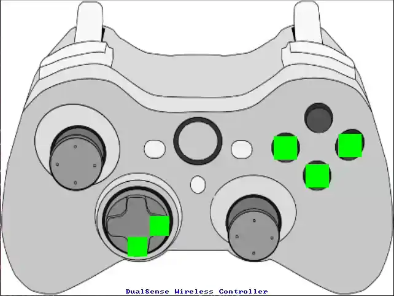
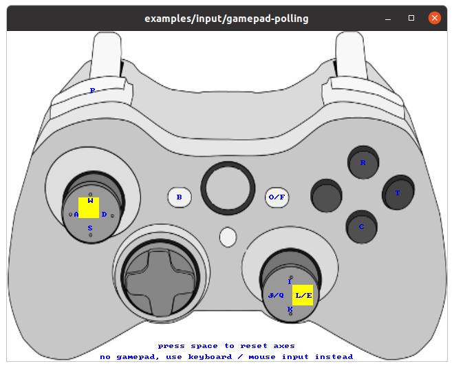

## 手柄使用

当插入手柄时，它能可视化手柄状态，如图所示:



当不插入手柄时，它靠键盘/鼠标输入模拟手柄状态，如图所示:



键盘键位如图所示，按钮可以直接用鼠标左键按，摇杆可以用鼠标拖。

不论是否有插入手柄，它都会将手柄数据通过 lejusdk 发送 `JoyData`。

在窗口不可用的情况下，例如 SSH 远程连接，它仍然可以读取插入的手柄数据并发送。

## Joy 自启动方案

`leju-joystick` 当前还包含一套手柄自启动链路，用于在实物机器人上通过 `START/BACK` 管理 runtime。

### 部署

部署脚本同时兼容闭源 `lejulab_platform` 和开源 `lejulab` 两种工作区布局，但需要在**工作区根目录**以 `root` 身份执行。

闭源仓库 `lejulab_platform`：

```bash
cd <lejulab_platform_workspace>
sudo ./src/leju-joystick/services/deploy_joy_autostart.sh
```

开源仓库 `lejulab`：

```bash
cd <lejulab_workspace>
sudo ./installed/share/leju-joystick/services/deploy_joy_autostart.sh
```

卸载服务时，执行同一路径并追加 `--remove`：

闭源仓库 `lejulab_platform`：

```bash
cd <lejulab_platform_workspace>
sudo ./src/leju-joystick/services/deploy_joy_autostart.sh --remove
```

开源仓库 `lejulab`：

```bash
cd <lejulab_workspace>
sudo ./installed/share/leju-joystick/services/deploy_joy_autostart.sh --remove
```

脚本会根据自身所在目录自动识别当前是闭源还是开源工作区，无需额外传参。

部署脚本会做这些事：

- 停止并禁用 `lejulab_joy_monitor.service`
- 编译工作区
- 重新安装并启动 `lejulab_joy_monitor.service`
- 将当前激活配置重置到仓库默认配置目录
- 执行 `src/leju_launch/scripts/setup_cyclonedds_config.sh`，自动部署 CycloneDDS / iceoryx 配置
- 复制一份前端可直接调用的配置切换脚本到 `/root/.config/lejulab/auto_start_config/set_active_profile.sh`

### 行为

- 第一次按 `START`：校验当前激活配置有效后，在 tmux 中启动 `load_real.launch auto_start:=true`
- 启动时显式传入 `controller_manager_config:=/root/.config/lejulab/auto_start_config/current/controller_manager.yaml`
- 第二次按 `START`：仅在 runtime 进入 `WaitingForStart` 时调用 `startRuntime()`
- 按 `BACK`：对自启动拉起的 runtime 调 `stopRuntime()` 并清理 tmux session
- runtime 异常退出后不会自动重启，必须重新按 `START`

### 使用与注意事项

- 当前激活配置入口固定为 `/root/.config/lejulab/auto_start_config/current`
- 自启动只读取 `current/controller_manager.yaml`
- 不显式传 `teleop_config`，仍使用仓库默认 teleop 配置
- `current` 不是 symlink、无法解析，或缺少 `controller_manager.yaml` 时，第一次 `START` 会被忽略
- `leju_joystick` 做了单实例保护，避免多份 `JoyData` 发布者同时工作
